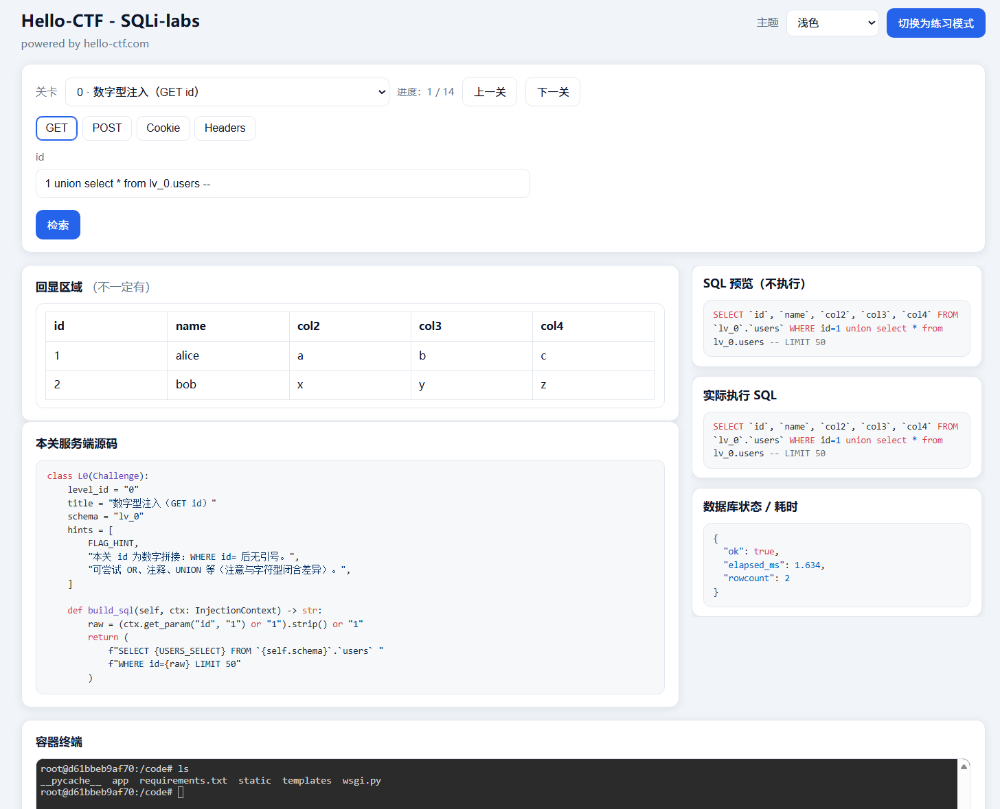

# Hello-CTF · SQLi-labs



面向 SQL 注入入门练习的阶梯靶场：

**练习模式**仅回显业务结果；

**上帝模式**额外展示 SQL 预览/执行语句、耗时与错误信息、关卡提示与实现源码，并提供 Web 终端。

## 快速启动

```bash
cd sqli-lab
docker compose up --build
```

浏览器访问：`http://127.0.0.1:8080`（compose 默认映射 `8080:80`）。

## 架构说明（单容器 / 单端口）

参考 `ctf-docker-template` 的 **web-lnmp-php73** 思路：容器内同时运行 **MariaDB + Gunicorn(Flask) + ttyd + Nginx**，对外只暴露 **一个端口（默认 80）**。

- 入口：**Nginx** 监听 `80`
- 业务：`/` 反代到 `127.0.0.1:5000`（Gunicorn）
- 终端：`/terminal/` 反代到 `127.0.0.1:7681`（ttyd）

## 动态 Flag（与模板一致）

支持以下环境变量（优先级从上到下）：

- `DASFLAG`
- `FLAG`
- `GZCTF_FLAG`

若都未设置，则使用 `STATIC_FLAG`（默认 `HelloCTF{sql_injection_lab}`）。

## 重置数据库

1. 在运行环境中设置 `RESET_TOKEN`
2. 页面底部输入相同令牌并点击「重置数据库」

后端会执行 `mysql` 重新导入 `/docker-init/01_init.sql`，并再次把 Flag 写回各关库表 **`flag_store`**（不在 `users` 中，避免默认查询直接泄露）。

## 终端（ttyd）

`/terminal/` 提供 bash（ttyd 使用 **`--writable`** 以允许键盘输入）；已在容器内为 `root` 写入 `/root/.my.cnf`，可直接使用：

```bash
mysql
```

默认使用应用账号连接本机 MariaDB（见 compose 环境变量 `MYSQL_APP_USER` / `MYSQL_APP_PASSWORD`）。

## 安全声明

本镜像包含 **完整 shell** 与 **数据库高权限重置能力**（在配置 `RESET_TOKEN` 后）。仅建议在 **本地 / 隔离 VLAN / 私有 CTF 环境** 使用；**不要**在未做访问控制的情况下对公网直接暴露。

## root 密码约定

`db/init/01_init.sql` 会将 `root@localhost` 密码设置为 **`root_change_me`**（与 `docker-compose.yml` 默认一致）。若你修改 `MYSQL_ROOT_PASSWORD`，请同步修改 SQL 文件末尾的 `ALTER USER` 语句，或自行改为启动脚本动态生成 SQL。
